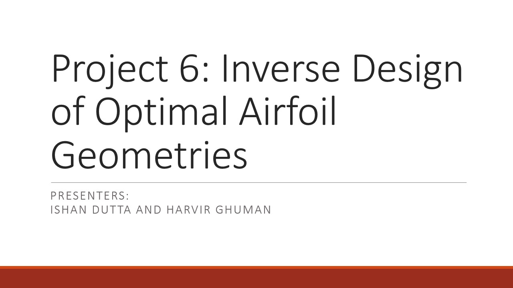
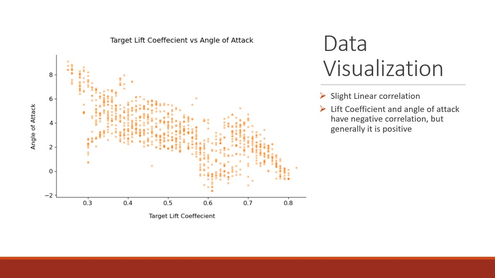
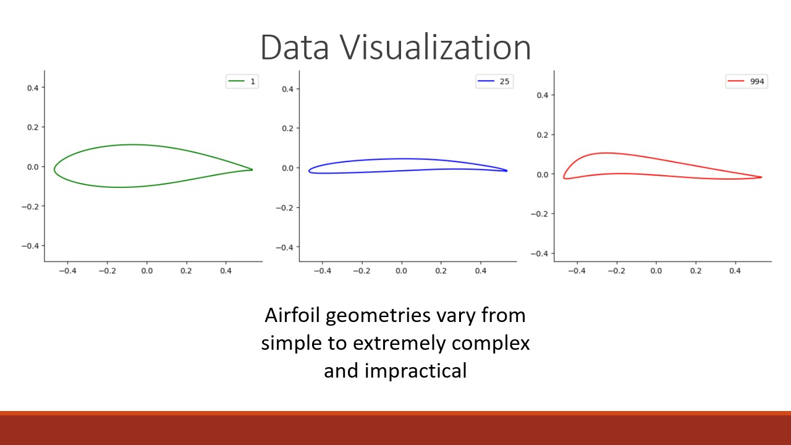

# Inverse-Design-of-Optimal-Airfoil-Geometry
A machine learning model to predict the final geometry of an airfoil given input boundary condtions such as Mach Number, Reynolds Number, or Target Lift Coeffecient

## Slide-by-slide preview

---

---

---

---

---

---

---

---

---

---

---

---

---

---

---

---

---

